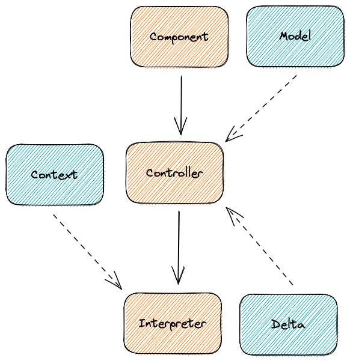

# Boxfight

## Design Notes

The user programs should operate based on semantic information
about the world around them, not on analog state. For example,
you shouldn't get positions of enemies in the XY plane from the
radar, you should get distances and headings relative to where
the gun is currently aimed.

### Update Cycle

When the turret component is updated, it delegates to the
`TurretController`, providing it the time step (`dt`), along
with the `TurretModel` instance (which is mutable).

The controller then decides if it is time to run the `TurretProgram`
and, if it does, provides the program with an encoded
version of the model. The program then returns a `TurretDelta`,
which contains the changes to be made.

These changes are then applied, weighted by the time step,
directly to the model.



On ticks when a program isn't set to run, the delta is applied
again (if necessary) to achieve as much of the desired result
in the allotted time period as possible.

### Language Interop

Communication between the player language and the game happens
through two binary file formats. The first allows the game to
send game state relative to the turret in question to the player
program (Turret Context). The second allows the player program
to send back commands for the turret (Turret Delta).

The Turret Context file layout is given below:

```
Field Name | Byte Width | Data Type
-----------|------------|----------
Ammunition | 8          | int64
Power      | 8          | float64
Enemies    | N * EC     | []EnemyContext
```

The term "EC" above represents the size of the Enemy Context
data structure. This structure, however, is variable, so the
exact size of a Turret Context is unknown until completely
assembled.

TODO: The above is a bummer, we could specify a special NULL value?

The `Enemies` field in the Turret Context is composed of zero
or more Enemy Contexts, described below:

```
Field Name    | Byte Width | Data Type
--------------|------------|----------
Direction     | 8          | float64
Flag 0        | 1          | bool
StrafeSpeed   | 8 or 0     | float64?
Flag 1        | 1          | bool
ApproachSpeed | 8 or 0     | float64?
Speed         | 8          | float64
Size          | 8          | float64
```

The two "flag" values above indicate whether there is data
present in the fields that follow them. Any non-zero value
is interpreted as "true", zero is interpreted as "false".
If a flag is false, the value that follows it should be treated
as if it were null or otherwise missing.

The Turret Delta file layout is given below:

```
Field Name | Byte Width | Data Type
-----------|------------|----------
Aim        | 8          | float64  
Fire       | 8          | int64    
```
